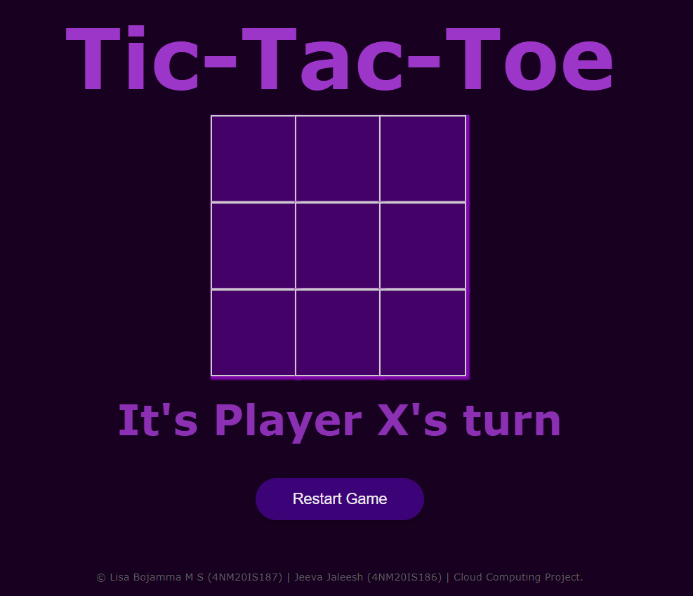
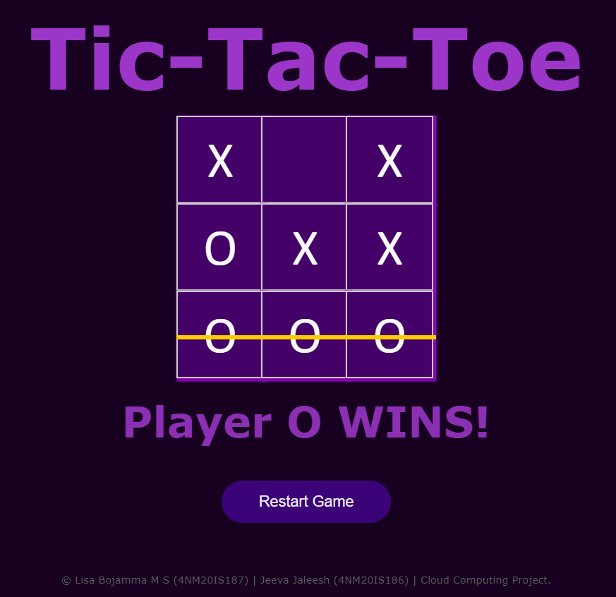

# Tic-Tac-Toe 

A simple **Tic-Tac-Toe** game built with **HTML, CSS, and JavaScript**, created as a project for our **Cloud Computing** class. This project demonstrates how to deploy a web application on **Netlify**, showcasing the advantages of cloud-based hosting and deployment services.

🔗 [Click here to play](https://tictactoe-lisa-jeeva.netlify.app/)


## ☁️ Why Netlify?
Netlify is a powerful cloud-based platform that simplifies the deployment and hosting of web applications. It offers:

- **Seamless Continuous Deployment:** Connect your GitHub repository, and Netlify will automatically deploy changes.
- **Fast and Secure Hosting:** Deliver your web app through a global CDN for better performance.
- **Free SSL Certificates:** Ensures secure connections with HTTPS.
- **Serverless Functions:** Extend your app without managing backend infrastructure.
- **One-click Rollbacks:** Instantly revert to previous versions if needed.

By using **Netlify**, we take advantage of **cloud computing services** to make our Tic-Tac-Toe game accessible from anywhere with minimal setup.


### 🎮 Game Interface


### ✅ Winning Condition



---

## 🏗️ Running Locally
1. Clone this repository:
   ```sh
   git clone https://github.com/your-github-username/tic-tac-toe-netlify.git
   ```
2. Open `index.html` in a web browser.

---

## 🚀 Deploying on Netlify
1. Push your code to a GitHub repository.
2. Sign in to [Netlify](https://www.netlify.com/).
3. Click on **"New site from Git"**.
4. Select your GitHub repository and deploy.
5. Netlify will handle the rest, making your web app live in seconds!


